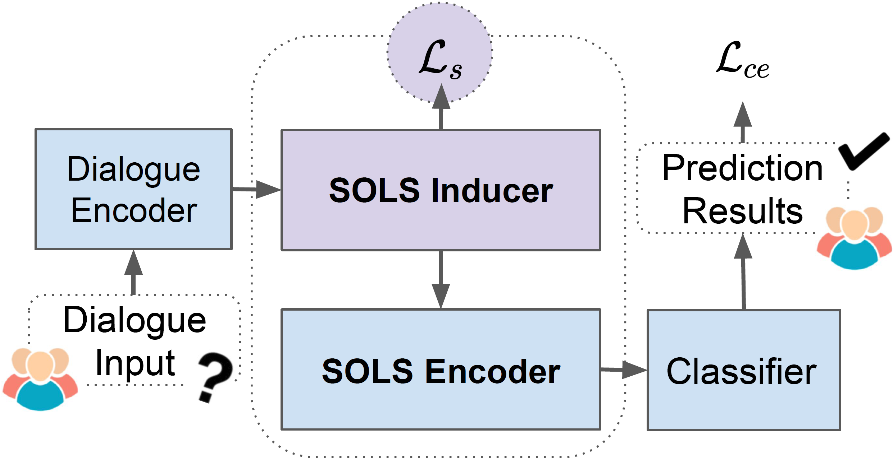
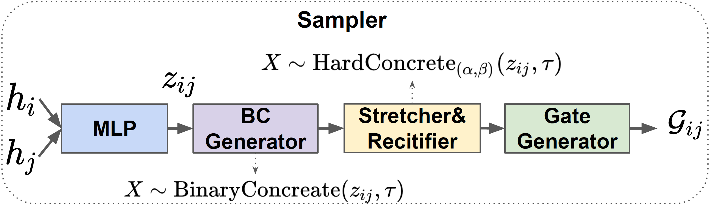
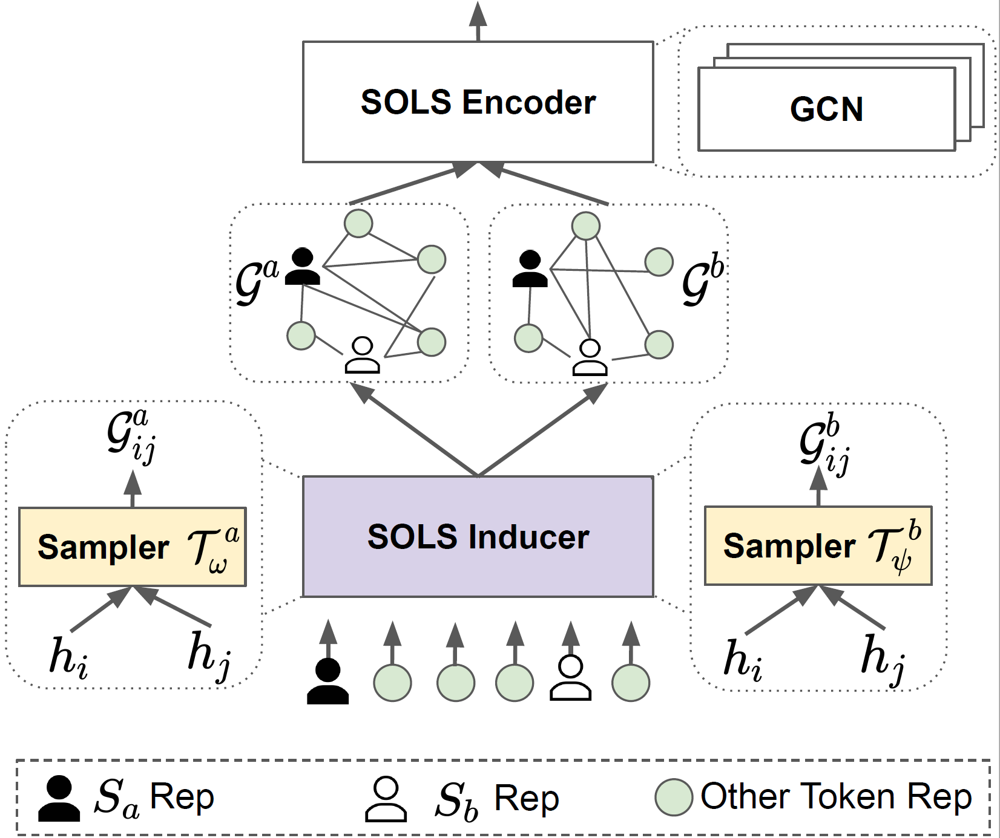

# Requirement
```
python>=3.6
torch>=1.7.1 
CUDA >= 10.2
```

# Overview of SOLS
The architecture of our proposed SOLS.
<p align="center">

</p>

Overview of our proposed sampler. The sampler takes the contextualized representations of the $i$-th and $j$-th token as input and samples a continuous gate $\mathcal{G}_{ij}$ for them.
<p align="center">

</p>

Overview of our proposed SOLS inducer and encoder. The inducer computes the dependency score between each two nodes in the dialogue. These learnable scores form two different latent graphs $\mathcal{G}^a$ and $\mathcal{G}^b$ for Speaker a and Speaker b, respectively. The two graphs will be fed into SOLS encoder for information aggregation.
<p align="center">

</p>


# Dataset

For the DialogRE-EN and DialogRE-CN dataset, please download from [here](https://github.com/nlpdata/dialogre/tree/master/data_v2), which are officially provided by [Dialogue-Based Relation Extraction](https://arxiv.org/abs/2004.08056). Please download Glove vectors from [here](https://www.kaggle.com/thanakomsn/glove6b300dtxt/data) and Chinese word embeddings from [here](https://pan.baidu.com/s/19wQrclyynOnco3JBvnI5pA). If argument types in DialogRE-CN dataset are needed, please download it [here](https://github.com/frankdarkluo/SOLS/tree/main/DialogRE/datacn).

# Dataset Processing

We implement the BiLSTM encoder on DialogRE-CN dataset with argument types annotated.

(1) Please copy the *.json files into DialogRE/SOLS/datacn

(2) Train the SOLS model
```sh
$ cd DialogRE/SOLS
$ python3 run_cn.py --latent_type sols --do_train --do_eval --learning_rate 3e-4   --num_train_epochs 20.0   --output_dir lstmcn_f1
```

(3) Eval on f1c
```sh
$ rm lstmcn_f1/model_best.pt
$ cp -r lstmcn_f1 lstmcn_f1c
$ python run_cn.py   --task_name lstmf1c --do_eval --data_dir . --learning_rate 3e-4   --num_train_epochs 20.0   --output_dir lstmcn_f1c
```

(4) Evaluation
```sh
$ python evaluate.py --f1dev lstmcn_f1/logits_dev.txt --f1test lstmcn_f1/logits_test.txt --f1cdev lstmcn_f1c/logits_dev.txt --f1ctest lstmcn_f1c/logits_test.txt
```

## Related Repo
Codes are adapted from the repo of the ACL2020 paper [Dialogue-Based Relation Extraction](https://github.com/nlpdata/dialogre) and AAAI2021 paper [GDPNet: Refining Refining Latent Multi-View Graph for Relation Extraction](https://github.com/XueFuzhao/GDPNet). 

